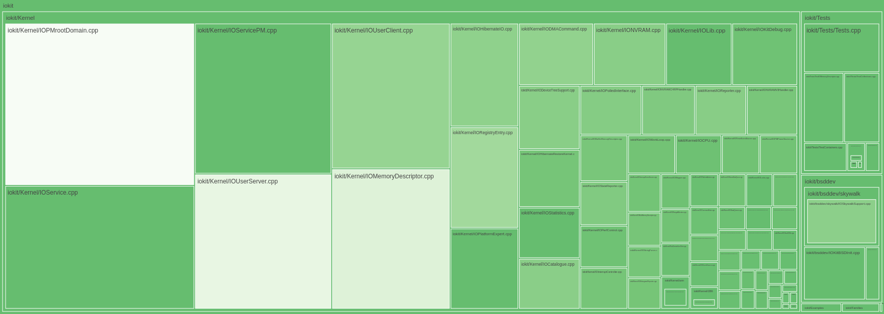

cyclo
=====

* computes the cyclomatic complexity given a file or directory of files and
visualizes it
* supports C and C++ file parsing
* plotly.js is used for the treemap visualization in browser
* very hacky
* awful looking web interface



usage
-----

```sh
# webserver and cyclo are different binaries so the cyclo can be recomputed
# without having to restart the server for visualization

# build and run cyclo
cd cyclo
cargo build
# compute the complexities for the files in the directory ../test
# this will generate a JSON
./target/debug/cyclo --path ../test
# or whatever path
# ./target/debug/cyclo --path ../../xnu/iokit
cd ..

# build and run webserver
cd webserver
cargo build
./target/debug/webserver --port 3030
```

also debug info can be printed to a file to check the nloc and cc

```sh
cd cyclo
./target/debug/cyclo --path ../test --debug
```

additionally, cargo generates docs super easily. very cool.

```sh
cd cyclo
cargo doc -p cyclo --no-deps
open target/doc/cyclo/index.html
```

treemap
-------

The size of the box corresponds to the number of lines of code, and the hotness of
the color corresponds to the cyclomatic complexity.

The colorscheme can be changed by editing the `colorscale` value in the `cyclo.js`
file in the `webserver/web/scripts` directory. Valid choices are mentioned in the
[Plotly documentation](https://plotly.com/javascript/reference/treemap/#treemap-marker-colorscale)


to do
-----

* generate ASTs (and therefore cyclomatic complexities) more accurately.
    * there are a lot of problems generating these with preprocessor macros,
    leading to large inaccuracies for some files. super annoying.
* improve the extension parsing and with that include support for more languages (js, py)
* refactor the nested for loops and if statements to be more rust-like.
    * it works for now but its gross
* maybe live updating of the webserver without needing to refresh the page?
* progress bar
